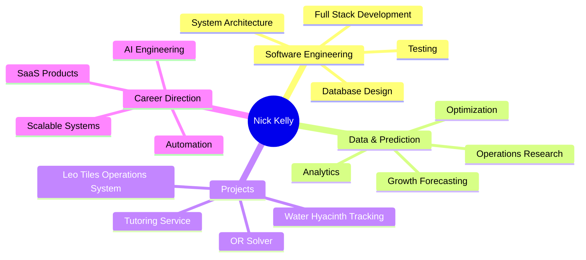
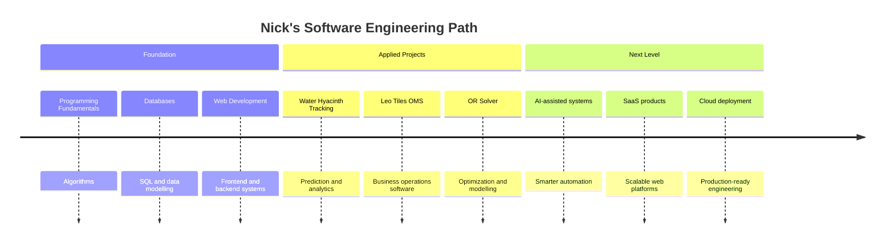

  

  

  
  
  

---

## About Me

Hi, I'm **Nick Kelly**, a FullStack Software Engineer .

I enjoy building practical software that solves real problems, especially systems involving automation, data analysis, operations, prediction models, and full-stack applications.

---

## Tech Stack

  

  
  
  
  

---

## Featured Projects

### Water Hyacinth Tracking and Growth Prediction

A system focused on tracking and predicting the growth of water hyacinths, combining environmental awareness with data-driven forecasting.

**Key areas:** prediction, tracking, analytics, environmental technology.

### Leo Tiles Operations Management System

An operations management system designed to improve workflow visibility, process tracking, and business efficiency.

**Key areas:** operations, dashboards, internal tools, business systems.

### Tutoring Service

A tutoring platform concept focused on connecting learners with academic support and structured learning assistance.

**Key areas:** education technology, booking flows, service management.

### Operations Research Solver

A solver built around operations research concepts, helping model and solve optimization-style problems.

**Key areas:** optimization, algorithms, mathematical modelling.

```mermaid
flowchart LR
    A[Problem] --> B[Research]
    B --> C[System Design]
    C --> D[Implementation]
    D --> E[Testing]
    E --> F[Iteration]
    F --> G[Real-World Use]

    style A fill:#0f172a,stroke:#38bdf8,color:#fff
    style B fill:#1e293b,stroke:#38bdf8,color:#fff
    style C fill:#1e40af,stroke:#93c5fd,color:#fff
    style D fill:#7c3aed,stroke:#c4b5fd,color:#fff
    style E fill:#065f46,stroke:#34d399,color:#fff
    style F fill:#92400e,stroke:#fbbf24,color:#fff
    style G fill:#881337,stroke:#fb7185,color:#fff
```

---

## GitHub Analytics

  
  

  

  

---

## GitHub Trophies

  

---

## Engineering Direction

---

## Current Focus

- Building stronger full-stack systems.
- Improving data modelling and backend architecture.
- Learning how to turn software projects into polished, usable products.
- Exploring AI, automation, analytics, and optimization.

---

## Connect With Me

  
  

  

  

